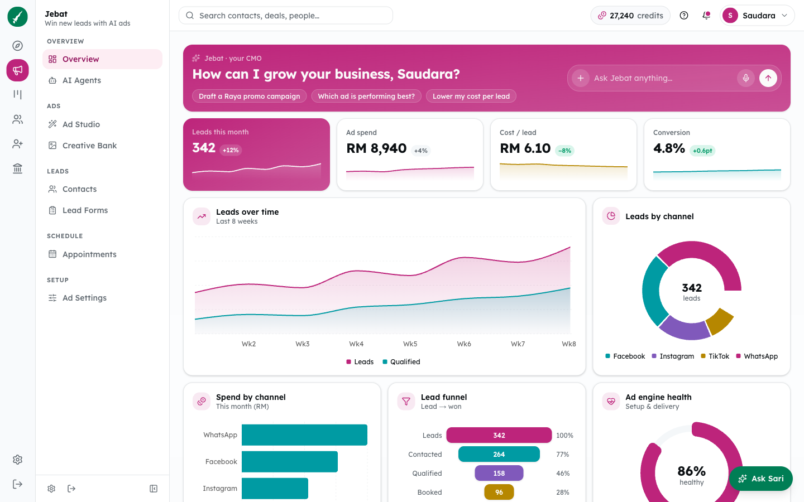
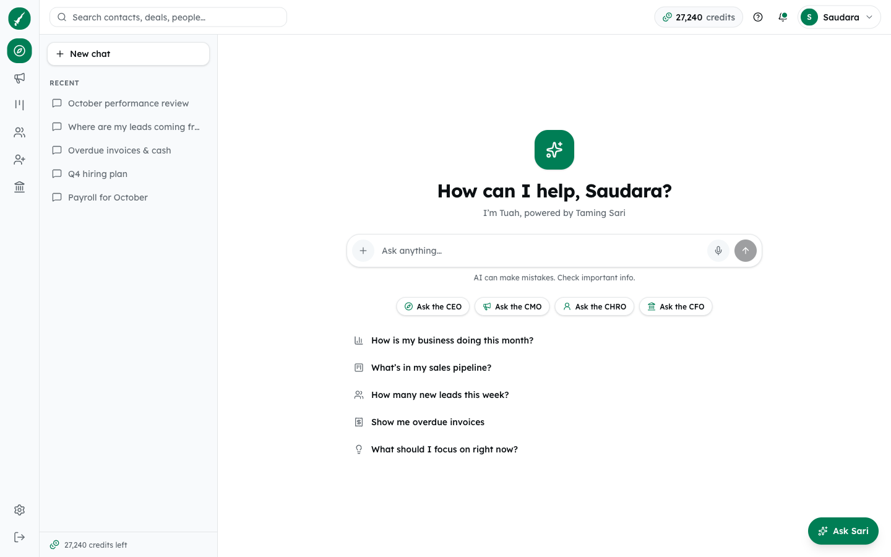
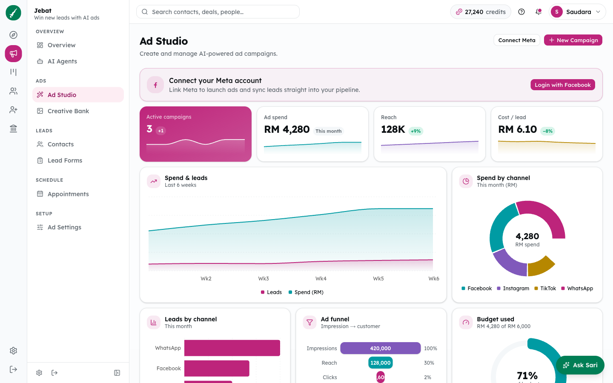
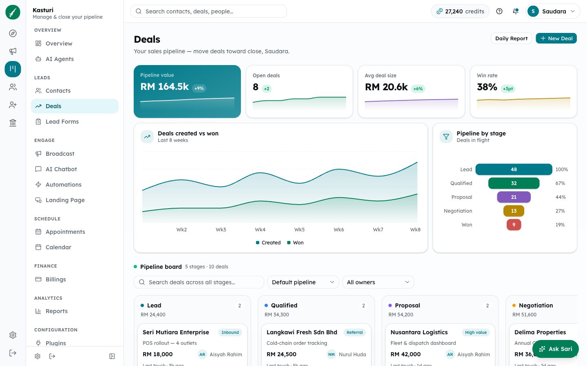
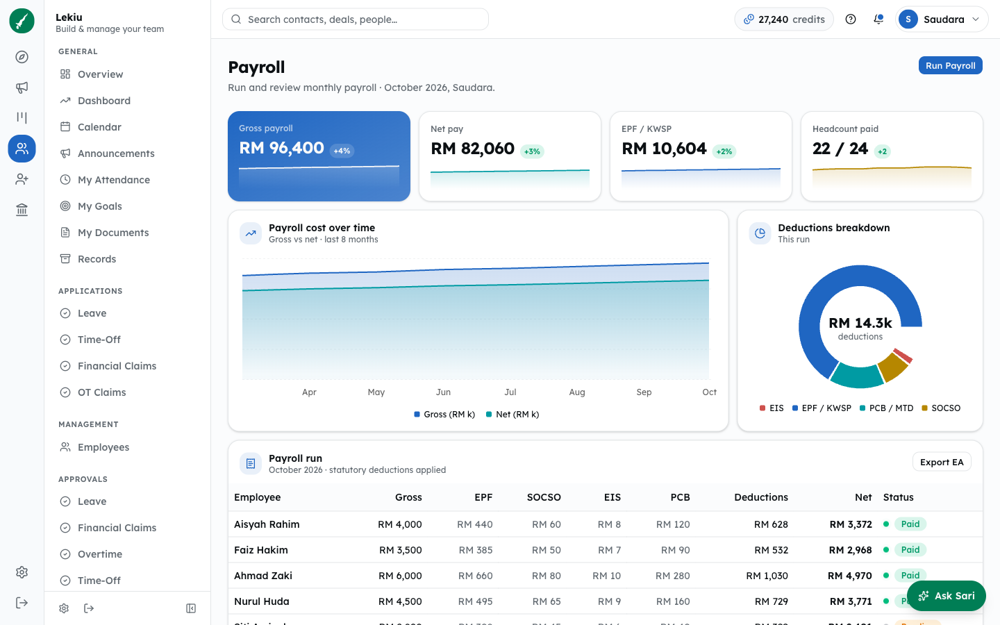
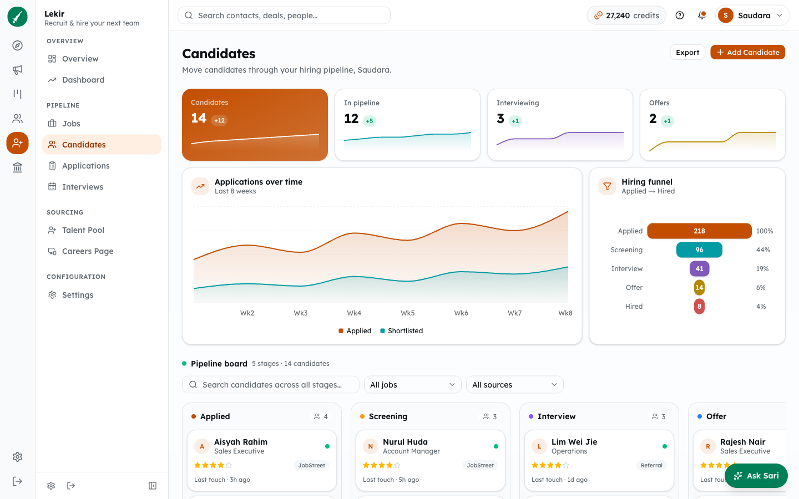
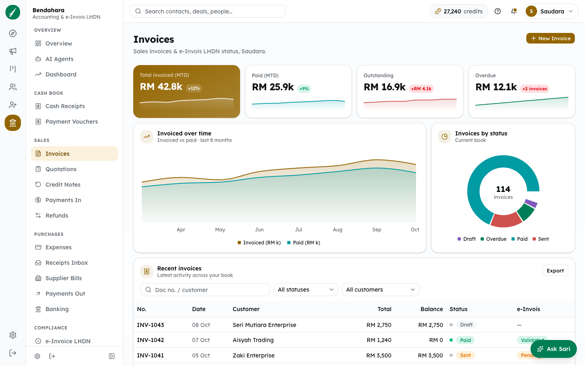
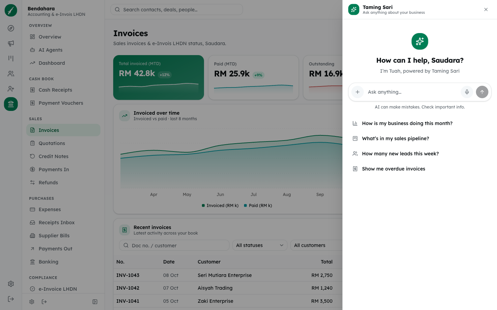
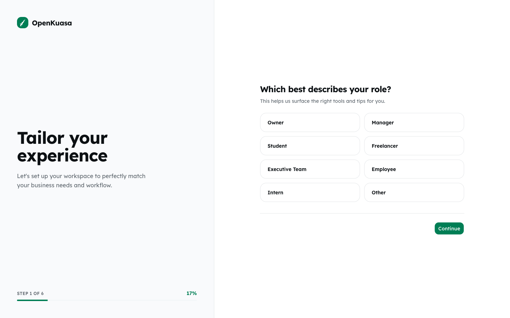

# OpenKuasa OS

**The open-source business OS for Malaysian SMEs — one self-hostable app
instead of a stack of separate CRM, HR, payroll and accounting subscriptions.**
Ads, CRM, HR, recruitment and accounting in one place, with an AI command center
on top — built in the open on Next.js, React and Supabase.

OpenKuasa is crowd-sourced: it is developed in the open by its maintainers and
volunteer contributors.

**Free to self-host, always.** A paid hosted version is planned for people who
would rather not run it themselves. It is built on the code in this repository,
which stays open source under AGPL-3.0.

<p align="center">
  
</p>

> [!IMPORTANT]
> **OpenKuasa is an independent, community-run project.** It is not affiliated
> with, endorsed by, or connected to any other company or product, and it speaks
> only for its own contributors.
>
> - Everything in this repository was written from scratch by the community. It
>   contains no third-party source code, proprietary assets or customer data.
> - Any third-party product or company names that come up belong to their
>   respective owners, and are used only to describe the kind of software this is
>   an alternative to.
> - The software is provided "as is", without warranty of any kind — self-host it
>   at your own risk.

## What's inside

Six modules and a cross-app assistant, named after the Malay warriors and court
of Melaka. **83 module screens** are built so far.

| Module | What it does | Alternative to | Route | Screens |
| --- | --- | --- | --- | --- |
| **Tuah** | AI command center — chat with your whole business | AI business copilots | `/command` | chat |
| **Jebat** | Ads — ad studio, creative bank, lead forms, reports | ad platforms & agencies | `/reach` | 10 |
| **Kasturi** | CRM — contacts, deals kanban, broadcast, chatbot, automations | CRM tools | `/crm` | 11 |
| **Lekiu** | Team — employees, attendance, leave, claims, payroll, performance | HR & payroll suites | `/people` | 27 |
| **Lekir** | Recruit — jobs, candidates, applications, interviews, talent pool | recruiting (ATS) | `/hire` | 9 |
| **Bendahara** | Finance — invoicing, expenses, banking, e-Invoice, SST, ledgers | accounting software | `/finance` | 26 |
| **Taming Sari** | "Sari", the assistant available from every screen | — | everywhere | — |

The full menu for each module lives in `src/config/nav.ts`. The screens are in
`src/screens/` and are listed in `src/screens/registry.ts`; each one is served by
its own route file under `src/app/(app)/`, written by `pnpm gen:routes` (see
[Adding a screen](CONTRIBUTING.md#adding-a-screen)).

### Module highlights

- **Tuah** — a command chat with rich reply cards, plus an Ask Sari
  conversation view.
- **Jebat** — overview dashboard, AI agents, Ad Studio, Creative Bank, reports,
  contacts, lead forms, appointments, ad settings and an account health check.
- **Kasturi** — CMO assistant, deals pipeline as a kanban board, broadcasts, AI
  chatbot, automations, landing pages, calendar, billings, plugins and reports.
- **Lekiu** — employee self-service (attendance, goals, documents), leave /
  time-off / claims / overtime applications with a matching approvals queue,
  timesheets, shift calendar, payroll, payment vouchers, scorecards and
  training.
- **Lekir** — recruiter assistant, hiring dashboard, jobs, candidates kanban,
  applications, interviews, talent pool and a careers page builder.
- **Bendahara** — cash book, quotations, invoices, credit notes, refunds,
  supplier bills, receipts inbox, banking, e-Invoice LHDN, SST report, audit
  trail, journals, chart of accounts, contra entries and FX revaluation.

### Platform

- **App shell** — a two-level sidebar (product rail + collapsible per-module
  menu), responsive down to mobile.
- **Marketing site** — landing page with a products mega-menu, pricing and
  privacy pages.
- **Auth flow** — login and a multi-step onboarding.
- **Account area** — 19 pages: profile, company, team, clients, security,
  notifications, plan, subscriptions, add-ons, payment methods, transactions,
  connected apps, developers, activity, changelog, docs, support and feedback.
- **Polish** — loading skeletons, empty states and not-found pages throughout.

## Screenshots

A look at the running app (sample data):

| | |
| :---: | :---: |
| <br>**Tuah** · AI command center | <br>**Jebat** · AI Ad Studio |
| <br>**Kasturi** · deals pipeline | <br>**Lekiu** · payroll |
| <br>**Lekir** · candidate pipeline | <br>**Bendahara** · invoicing |
| <br>**Taming Sari** · ask Sari from any screen | <br>**Onboarding** · multi-step setup |

## Status

OpenKuasa OS is in early development. Being upfront about where it stands:

- **Built** — the complete product surface listed above: every screen,
  navigation, layout and interaction, running on sample data.
- **Not wired up yet** — a live backend. Screens do not read from or write to a
  database, the AI assistants and agents do not call a model, and integrations
  such as ad platforms, WhatsApp, payroll filings and LHDN MyInvois submission
  are not connected. Supabase is scaffolded for auth and data but nothing
  depends on it yet.

It is not ready to run a real business on. Contributions towards the backend
are very welcome.

## Contributing

OpenKuasa is built by its contributors, and anyone can join in — code, design,
docs, translations, bug reports and ideas are all welcome. See
[CONTRIBUTING.md](CONTRIBUTING.md) for how to get started.

- Report a bug or suggest a feature:
  [open an issue](https://github.com/OpenKuasa/OpenKuasaOS/issues/new/choose)
- Looking for something to pick up:
  [good first issues](https://github.com/OpenKuasa/OpenKuasaOS/labels/good%20first%20issue)
- Found a security problem: follow the [security policy](SECURITY.md)
- Everyone taking part follows the [Code of Conduct](CODE_OF_CONDUCT.md)

One rule matters above all: **contribute only your own original work.** Never
copy code, text, designs, screenshots or assets from any proprietary product.

Contributions are accepted under a Contributor License Agreement, set out in
`CONTRIBUTING.md`. You keep your copyright, and everything accepted into this
repository stays available under AGPL-3.0.

## Stack

- **Next.js 16** (App Router, Turbopack) + **React 19**
- **TypeScript**, **Tailwind CSS v4**
- **shadcn/ui** (Radix primitives, `radix-nova` preset)
- **Supabase** (`@supabase/ssr`) for data, auth, and tenancy

## Getting Started

Requires Node 20+ and [pnpm](https://pnpm.io).

```bash
git clone https://github.com/OpenKuasa/OpenKuasaOS.git
cd OpenKuasaOS
pnpm install
pnpm dev
```

Open [http://localhost:3000](http://localhost:3000).

## Environment variables

Create a `.env.local` file in the project root with your Supabase project's
values (Supabase dashboard → Project Settings → API):

```bash
NEXT_PUBLIC_SUPABASE_URL=https://<your-project-ref>.supabase.co
NEXT_PUBLIC_SUPABASE_ANON_KEY=<your-anon-key>
```

Until these are set, the app runs normally but the Supabase session refresh is a
no-op — see `src/lib/supabase/middleware.ts`.

## Self-hosting setup

Beyond the environment variables above (see `.env.example` for the full list:
the Supabase URL and anon/publishable key; the OpenRouter key is for a later
slice), a fresh Supabase project needs these Auth settings (Supabase dashboard →
Authentication) for sign-in and signup to work:

- **Enable Anonymous sign-ins** — powers the demo workspace and the tests.
- **Turn OFF "Confirm email"** — signup then creates a session immediately and
  lands on `/command`. With it on, signup stops at a "check your email" message
  and the user must confirm and sign in.
- **Leave hCaptcha OFF for now** — the auth forms don't yet pass a captcha
  token, so *enabling* hCaptcha would break sign-in and signup. Wiring the
  hCaptcha widget into the auth UI is a planned hardening step before it can be
  turned on in production.

## Supabase helpers

- `src/lib/supabase/client.ts` — browser client (Client Components)
- `src/lib/supabase/server.ts` — server client (Server Components, Route Handlers, Server Actions)
- `src/lib/supabase/middleware.ts` + `src/proxy.ts` — session refresh

## Scripts

```bash
pnpm dev      # start the dev server
pnpm build    # production build
pnpm start    # run the production build
pnpm lint     # eslint
```

## License

[AGPL-3.0](LICENSE). You are free to use, modify and self-host OpenKuasa OS. If
you run a modified version as a network service, you must make your source
available to its users under the same license.

The license covers this project's code only. It grants no rights to any
third-party names, marks or products.
